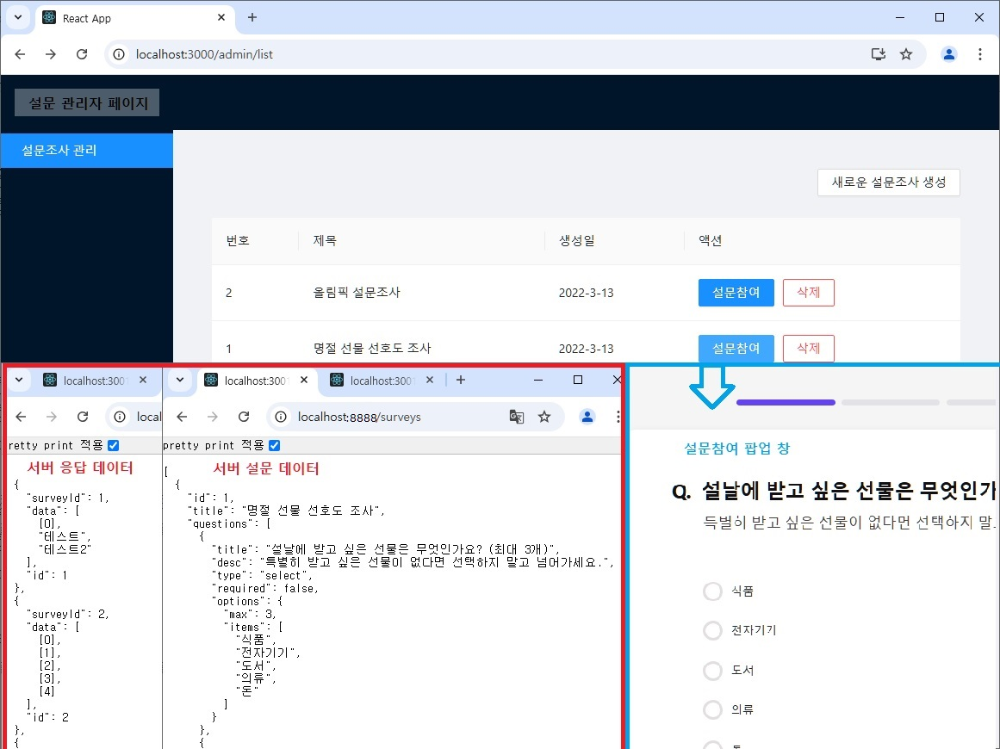
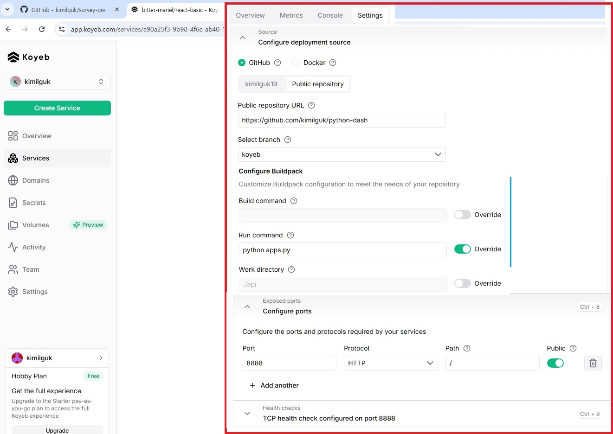
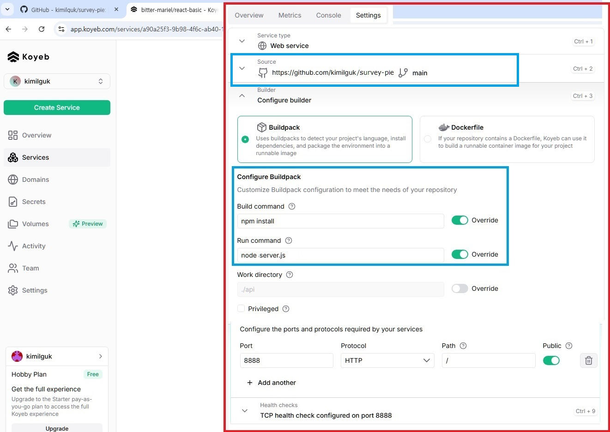

# 앞으로 할 일

- 관리자페이지 접근 권한을 추가한다.
- 관리자페이지에 설문결과를 표시하는 기능 페이지를 추가한다.

# 작업완료

- ## 기존 강의 소스에서 사용자페이지와 관리자페이지 경로를 분리한다.
  - 기존 설문관리앱, 설문참여앱, JSON서버앱 이렇게 3개로 분리된 앱을 src폴더 내에 admin, home, server폴더로 분리한 후 1개의 앱으로 통합.
    - 위 3개의 폴더로 분리 후 최상위 루트경로에 public 이동 및 admin, home, server폴더를 src폴더로 감싸준다.
    - 위 작업 후 소스에서 Routes와 Link 태그 및 navigate() 함수에 /admin/... 경로를 추가하면 된다.
- ## 사용자페이지+관리자페이지+JSON서버를 코예브 클라우드에 배포한다.(무료라서 메모리부족으로 실패해서 JSON서버만 코예브 클라우드에 배포)
  - JSON-서버시작은 이 문서 하단의 package.json 파일에서 루트의 server.js로 분리 시켰음.
  - JSON-서버에 등록된 질문모두확인: https://interior-sondra-kimilguk-app-99ae6359.koyeb.app/surveys
  - JSON-서버에 등록된 질문1개확인 : https://interior-sondra-kimilguk-app-99ae6359.koyeb.app/surveys/1
  - JSON-서버에 등록된 답변모두확인: https://interior-sondra-kimilguk-app-99ae6359.koyeb.app/answers
  - JSON-서버에 등록된 답변1개확인 : https://interior-sondra-kimilguk-app-99ae6359.koyeb.app/answers/1
- 사용자페이지+관리자페이지를 깃 허브 https://kimilguk.github.io/ 에 배포.
  - 사용자+관리자 페이지의 JSON서버 경로를 클라우드로 변경 (아래 2개 파일)
    - 사용자페이지: src\home\services\apis\mainApi.js
    - 관리자페이지: src\admin\lib\fetcher.js
    - npm run build 명령으로 build 폴더와 실행파일을 생성한 후 build폴더 내부 파일을 kimilguk.github.io 깃 저장소에 업로드 한다.

# 실행결과 미리보기(아래)



```
/*
    위 서버실행테스트 : node server.js
    서버실행테스트 : http://localhost:8888/surveys
    위 사이트실행테스트 : npm run start
    사용자홈페이지 실행테스트 : http://localhost:3000/1/0
    관리자홈페이지 실행테스트 : http://localhost:3000/admin
  */
```

# 실행 환경 :

- 실습에 사용된 실행 환경: 노드 16.14.0버전, npm 8.3.1버전
- JSON-SERVER 기술참조 : https://github.com/hackurity01/survey-pie-server
- 초기에 1번만 npm install 명령으로 사용자페이지+관리자페이지+JSON서버에 필요한 외부 라이브러리를 설치된다.

# VS Code 셋팅 :

- eslint 플러그인(CeateReactApp에 내장됨) : 실시간으로 jsx문법 및 코드 스타일을 검사해 화면에 표시해주는 도구
  - package.json 파일의 eslintConfig 항목속 기본내용으로 그냥 둔다.
  - 단, 터미널 종류가 cmd(명령프롬프트) 상태에서는 소스 수정 후 저장 시 eslint-config-react-app 오류가 발생 되는 된다면(아래 계속),
  - package.json파일을 연 상태에서 재 저장해 주면 해결 되는 듯 보이지만, 항상 수정 후 컴파일 때마다 해 주는것도 문제고, npm run build 시 똑같은 문제가 발생한다.
  - 위 오류를 해결 하는 방법은 아래와 같다. npm 캐시에 보관된 내용을 지우는 run npm cache clear --force 이 명령이 핵심이다.(아래)

```
Delete package-lock.json
Delete node_modules
run npm cache clear --force
npm install
```

- Prettier-Code formatter 플러그인 설치 : 문서서식을 자동으로 맞춰주는 VS Code의 도구로 코딩 스타일을 통일성있게 해 준다.
  - 플러그인 설치 후 VS Code 파읾메뉴의 설정항목에서
    - formatter로 검색 후 Default Formatter를 Prettier 로 선택한다.
    - save로 검색 후 Format on save 를 체크한다.
- 기존소스에서 import 순서를 자동으로 정리하는 simple-import-sort는 작동오류때문애 제거하고, 아래 설정내용도 지운다.

  - 라이브러리 제거 명령어: npm uninstall eslint-plugin-simple-import-sort

  ```
  /* package.json에서 아래 import 순서를 자동으로 정리하는 내용을 제거한다. */
  "plugins": [
      "simple-import-sort"
    ],
    "rules": {
      "simple-import-sort/imports": "error",
      "simple-import-sort/exports": "error"
    }
  ```

  - 침고: .eslintrc.json 외부 파일기술 : https://velog.io/@holim0/ESLint-importorder로-import-순서-다루기

# 클라우드 셋팅 및 관리자단 외부라이브러리 의존추가 : 아래package.json파일내용

```
  /* 아래 코예브 클라우드에서 사용할 노드 버전 설정 */
  "engines": {
    "node": ">=16.14.0 <=16.14.0"
  },
  ...
  /* 아래 부터는 관리자에서 사용하는 외부라이브러리 */
    "@ant-design/icons": "^4.7.0",
    "@reduxjs/toolkit": "^1.7.2",
    "antd": "^4.18.6",
    "immer": "^9.0.12",
    "react-redux": "^7.2.6",
    /* 아래 SWR 라이브러리란? “Stale-While-Revalidate”라는 비동기 fetchAPI작업을 도와주고, 리덕스와 리코일을 대신할 수 있는 전역데이터 상태관리 라이브러리이다.
    */
    "swr": "^1.2.1"
    /* 아래 JSON-API서버에서 사용하는 외부라이브러리 추가(아래) */
    "json-server": "^0.17.0"

  /* 아래 json-server에서 사용할 실행 명령어 추가 이 부분은 무시한다. 외부 server.js 파일로 분리하였다. */
  "scripts": {
    ...
    "server": "json-server --watch ./src/server/db.json --port 8888", //실행 시 npm run server 로 실행 가능하다.
    ...
  }
```

# 클라우드에 JSON-서버 설정 : 기존 파이썬 앱을 설문조사 앱에서 사용하는 JSON-서버 앱으로 변경하였다.(아래)

## 코예브 클라우드 수정 전(아래)



## 코예브 클라우드 수정 후(아래)


